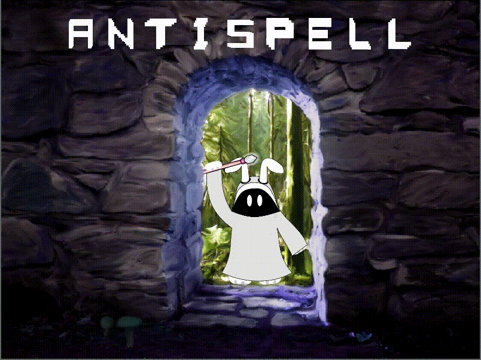

## ANTISPELL

### Description

A top-down shooter where you have to use your enemies' attacks to spell your spells!

### Features

 - Absorb letters getting close to enemy attacks. But don't get too close!
 - Use the letters to form real language words.
 - Most words do something interesting! Try them out.
 - Bullet time when enemy attacks are close.
 - Use the right spells to avoid the dangers of each level and reach the stairs.

### Controls

Keyboard:
 - W, A, S, D to move
 - R to restart.

Mouse:
 - Move the mouse to look/aim.
 - Hold left click shoots the spell (if you formed a valid word).
 - Right click deletes last letter.

### Screenshots

### Developers

- Francisco Casas

Greetings from 🇨🇱!

<!-- ### Links

 - YouTube Gameplay: $(YouTube Link)
 - itch.io Release: $(itch.io Game Page) -->

### Thanks

Sound effects made using https://sfbgames.itch.io/chiptone and https://raylibtech.itch.io/rfxgen

### License

This game sources are licensed under an unmodified zlib/libpng license, which is an OSI-certified, BSD-like license that allows static linking with closed source software. Check [LICENSE](LICENSE) for further details.

*Copyright (c) 2022 Francisco Casas (autopawn)*

